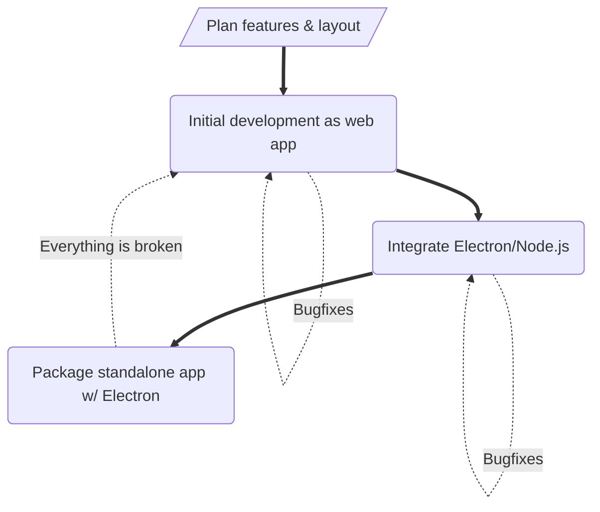

# Another Todo List
This is just meant to be a simple todo list app to keep me in practice and potentially get a useful tool out of. The inevitable feature creep will also be a good opportunity to learn some new things.
 

### Packaging with Electron
If all goes to plan, Electron will be used in order to package this web application into something usable on it's own. PySimpleGUI isn't supposed to be used "at work" and Java Swing makes me sad, so I'd mostly like to see how easy it is to create GUI-enabled applications without such tools. If this doesn't work how I'd like it to, I guess we're going back to Swing.
 

